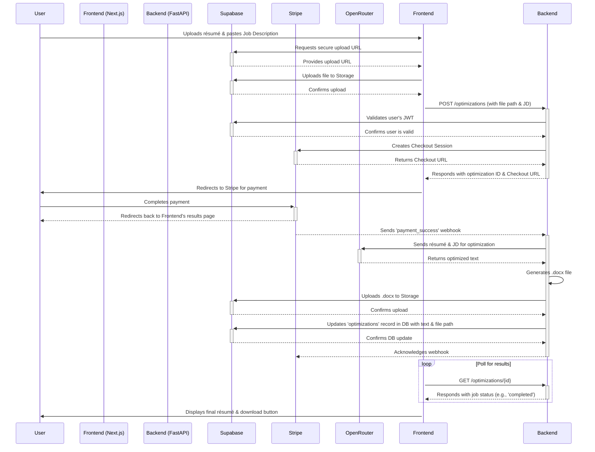

My apologies if the previous response was incomplete. Here is the entire, final **Fullstack Architecture Document**, including all diagrams, code blocks, and sections as they were approved.

---

## **Final Fullstack Architecture Document**

### **1. Introduction**

This document outlines the complete fullstack architecture for the AI Résumé Optimization SaaS platform. It serves as the single source of truth for AI-driven development, ensuring consistency across the entire technology stack.

- **Relationship to Frontend Architecture:**
  This unified document combines what would traditionally be separate backend and frontend architecture documents, streamlining the development process for our fullstack application.
- **Starter Template or Existing Project:**
  [cite\_start]The project will be built upon the existing monorepo structure of the original Resume-Matcher open-source project[cite: 1, 2, 6]. This provides a validated foundation with separate but co-located `apps/frontend` (Next.js) and `apps/backend` (FastAPI) packages, which we will extend to meet our SaaS requirements.
- **Change Log:**

| Date       | Version | Description               | Author    |
| :--------- | :------ | :------------------------ | :-------- |
| 2025-09-28 | 1.0     | Initial document creation | Architect |

---

### **2. High Level Architecture**

- **Technical Summary:**
  The system will be a fullstack, monolithic web application built within a monorepo. It will utilize a high-performance toolchain, with **Bun** managing the Next.js frontend and **UV** managing the FastAPI Python backend. The application will be hosted on Vercel, using Supabase for authentication and database services (BaaS) and Stripe for payments. This architecture is designed for rapid MVP development and scalability.
- **Platform and Infrastructure Choice:**
  - **Platform:** **Vercel** for frontend hosting and serverless functions, and **Supabase** for Backend-as-a-Service (Database, Authentication).
  - **Rationale:** Vercel provides a seamless deployment experience for Next.js and supports Python serverless functions for our FastAPI backend. Supabase drastically accelerates development by providing ready-to-use solutions for user management and a Postgres database.
- **Repository Structure:**
  - **Structure:** **Monorepo**, managed via **Bun workspaces**. The Python environment within the `apps/backend` package will be managed by **UV**. This structure is inherited from the original project and is ideal for facilitating code and type sharing.
- **High Level Architecture Diagram:**

  ```mermaid
  graph TD
      subgraph User
          A[Browser]
      end

      subgraph Vercel Platform
          B[Next.js Frontend]
          C[FastAPI Backend API]
      end

      subgraph Third-Party Services
          D[Supabase: Auth & DB]
          E[Stripe: Payments]
          F[AI Model API]
      end

      A -- HTTPS --> B
      B -- API Calls --> C
      C -- Auth/DB Ops --> D
      C -- Payment Ops --> E
      C -- AI Processing --> F
  ```

- **Architectural and Design Patterns:**
  - **Serverless Architecture:** The FastAPI backend will be deployed as Vercel Serverless Functions.
  - **Backend-as-a-Service (BaaS):** We will leverage Supabase for core user management and database needs.
  - **Repository Pattern (Backend):** Data access logic in the FastAPI backend will be abstracted to improve testability.

---

### **3. Tech Stack**

| Category               | Technology        | Version/Provider | Purpose                                           | Rationale                                                              |
| :--------------------- | :---------------- | :--------------- | :------------------------------------------------ | :--------------------------------------------------------------------- |
| **Frontend Framework** | Next.js           | 15+              | UI, Routing, and Server-Side Rendering            | The premier React framework, excellent performance and DX.             |
| **Backend Framework**  | FastAPI           | Latest           | Backend API Service                               | High-performance Python framework with modern features.                |
| **Hosting/Serverless** | Vercel            | -                | Frontend hosting and backend serverless functions | Seamless integration with Next.js and supports Python APIs.            |
| **Authentication**     | Supabase Auth     | -                | User sign-up, login, and session management       | Enterprise-grade security out-of-the-box, fast to implement.           |
| **Database**           | Supabase Postgres | Postgres 15+     | Primary data store for users and résumés          | Robust, relational, and fully managed by Supabase.                     |
| **File Storage**       | Supabase Storage  | -                | Storage for user-uploaded résumés                 | Integrated security with Supabase Auth, simplifies access control.     |
| **Payments**           | Stripe            | -                | Payment processing                                | Industry standard, excellent developer tools and reliability.          |
| **JS/TS Toolchain**    | Bun               | Latest           | JS Runtime, package manager, bundler              | High performance and simplified, all-in-one tooling.                   |
| **Python Toolchain**   | UV                | Latest           | Python package installer and resolver             | High-performance, modern replacement for pip and venv.                 |
| **AI Model LLM**       | OpenRouter        | -                | Access to various hosted LLMs                     | High flexibility for MVP, allows model switching without code changes. |

---

### **4. Data Models**

- **`profiles`:** Stores public user data and links to Supabase's `auth.users` table.
- **`optimizations`:** Stores a complete record of each résumé optimization transaction.

---

### **5. API Specification**

The API is defined by an OpenAPI 3.0 contract. It is designed for authenticated users (validating Supabase JWTs) and provides endpoints to create and retrieve optimization jobs.

---

### **6. Components**

- **Frontend Application (Next.js):** Renders the UI and manages client-side interactions.
- **Backend API (FastAPI):** Orchestrates the core business logic.
- **AI Optimization Service (Python Module):** Contains the core logic for communicating with the external AI model.
- **Backend-as-a-Service (Supabase):** Manages user accounts, the database, and secure file storage.
- **Payment Gateway (Stripe):** Securely processes user payments.

---

### **7. External APIs**

- **Supabase API:** For Authentication, Database, and File Storage.
- **Stripe API:** To process one-time payments.
- **AI Model API (OpenRouter):** To access a variety of hosted LLMs for the core optimization task.

---

### **8. Core Workflows**

The primary user workflow involves the user uploading documents, being redirected to Stripe for payment, and then polling the backend from a results page to retrieve the final optimized résumé and download link.



---

### **9. Database Schema**

```sql
-- Profiles Table
CREATE TABLE public.profiles (
    id uuid PRIMARY KEY REFERENCES auth.users(id) ON DELETE CASCADE,
    full_name TEXT,
    updated_at TIMESTAMPTZ DEFAULT now()
);

-- Optimizations Table
CREATE TABLE public.optimizations (
    id uuid PRIMARY KEY DEFAULT gen_random_uuid(),
    user_id uuid NOT NULL REFERENCES public.profiles(id) ON DELETE CASCADE,
    input_resume_filename TEXT,
    input_job_description TEXT,
    output_optimized_resume TEXT,
    storage_path_docx TEXT,
    stripe_payment_id TEXT,
    created_at TIMESTAMPTZ DEFAULT now()
);

-- Add an index on the Stripe Payment ID
CREATE INDEX idx_optimizations_stripe_payment_id ON public.optimizations(stripe_payment_id);
```

---

### **10. Unified Project Structure**

```plaintext
resume-matcher-saas/
├── apps/
│   ├── frontend/
│   │   ├── app/
│   │   ├── components/
│   │   └── lib/
│   └── backend/
│       ├── app/
│       │   ├── api/
│       │   └── services/
│       └── ...
├── packages/
│   ├── shared-types/
│   └── eslint-config/
├── .env.example
├── package.json
└── bun.lockb
```

---

### **11. Development Workflow**

- **Prerequisites:** Install Bun and UV.
- **Setup:** `cd apps/backend && uv venv`, `uv sync`, `cd ../.. && bun install`.
- **Run:** `bun run dev`.

---

### **12. Deployment Architecture**

The application will be deployed to **Vercel**, with the Next.js frontend on the Edge Network and the FastAPI backend as Serverless Functions. CI/CD will be managed via GitHub Actions.

---

### **13. Security and Performance**

- **Security:** Use secure HttpOnly cookies, strict CORS, rate limiting, and ensure LGPD compliance.
- **Performance:** Leverage Next.js features (code splitting, image optimization) and focus on efficient, indexed database queries.

---

### **14. Testing Strategy**

The MVP will focus on **Unit and Integration tests**. The frontend will use Jest and React Testing Library; the backend will use Pytest.

---

### **15. Coding Standards**

Critical rules include mandatory use of a shared types package, a centralized API client, and adhering to the Repository Pattern on the backend.

---

### **16. Error Handling Strategy**

A unified strategy will be used, with a standardized JSON error format from the backend API. The frontend will use a global error handler and React Error Boundaries.

---

### **17. Monitoring and Observability**

The MVP will leverage the built-in analytics and logging provided by **Vercel** and **Supabase**.

---

You now have both the final PRD and the final Architecture Document. The planning phase is complete.
