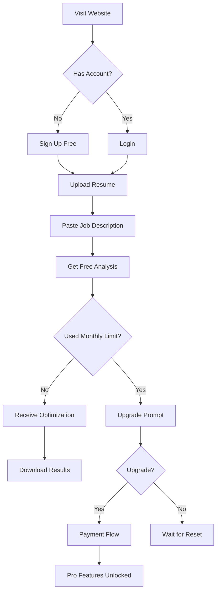
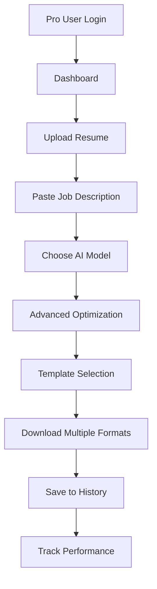
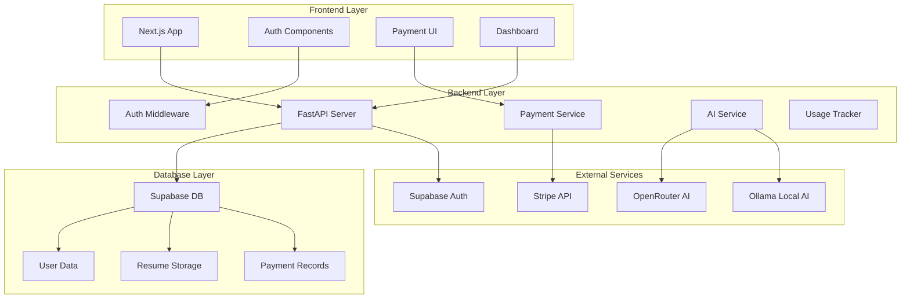
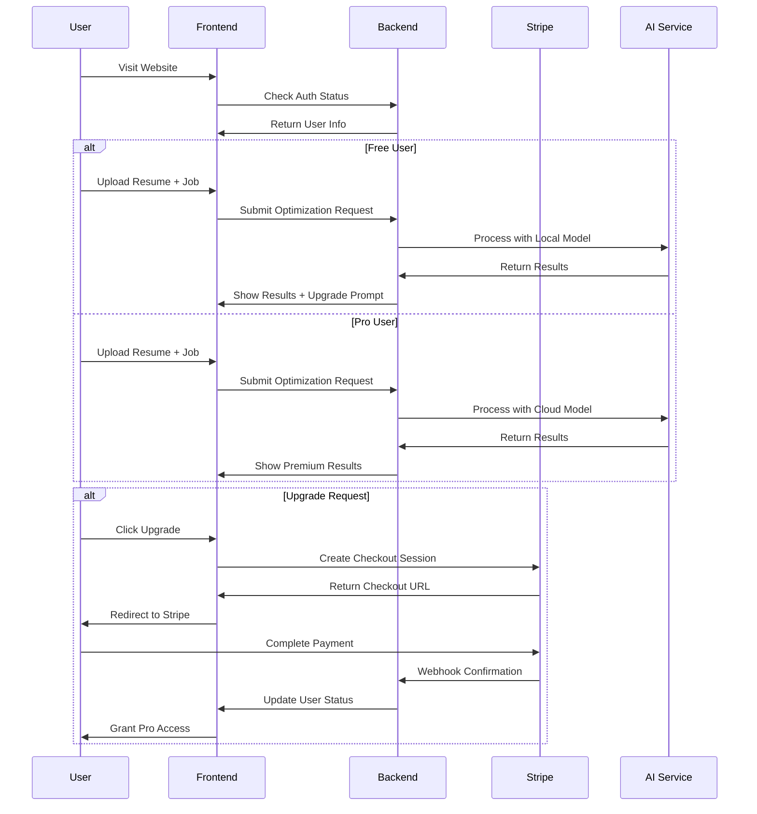

# Resume Matcher SaaS - Product Requirements Document

## 📋 Overview

**Vision**: Transform Resume Matcher from a free open-source tool into a sustainable **bootstrapped SaaS** using **QuoteKit's proven patterns** with a **freemium model** that preserves the original free tier while adding premium features.

**Business Model**: Hybrid Freemium (Free tier + $29 lifetime / $4.99/month Pro)

**Target Market**: Brazilian job seekers and professionals looking to optimize their resumes for ATS systems.

**Implementation**: **QuoteKit-based architecture** adapted from enterprise-grade SaaS patterns with **shadcn/ui components** for rapid development.

**Status**: 🔄 **IN PROGRESS** - Core QuoteKit features migrated, implementing **Internationalization** and **Blog System** next

---

## 🎯 MoSCoW Requirements Prioritization

### **MUST HAVE (Critical for MVP - Weeks 1-2)**

#### **M1: User Authentication System**

- **User**: As a new user, I want to create an account so I can save my optimizations
- **User**: As a returning user, I want to log in to access my previous work
- **Acceptance Criteria**:
  - Email/password authentication via Supabase Auth
  - Password reset functionality
  - Basic user profile creation

#### **M2: Freemium Feature Gating**

- **User**: As a free user, I want 1 optimization per month to try the service
- **User**: As a pro user, I want unlimited optimizations
- **Acceptance Criteria**:
  - Usage tracking per user (monthly limits)
  - Clear upgrade prompts when limit reached
  - Feature flagging system

#### **M3: Payment Integration**

- **User**: As a free user, I want to upgrade to Pro for $29 (lifetime)
- **User**: As a pro user, I want to optionally subscribe for $4.99/month
- **Acceptance Criteria**:
  - Stripe Checkout integration
  - Lifetime deal processing
  - Webhook handling for payment confirmation

#### **M4: Resume Optimization Core**

- **User**: As any user, I want to upload my resume and paste a job description
- **User**: As any user, I want to receive an AI-optimized resume
- **Acceptance Criteria**:
  - File upload (PDF/DOCX) to Supabase Storage
  - Job description text input
  - AI processing with local models (free) and cloud models (pro)
  - Results display and download

### **SHOULD HAVE (Important for Growth - Weeks 3-4)**

#### **S1: User Dashboard**

- **User**: As a pro user, I want to see my optimization history
- **User**: As any user, I want to track my monthly usage
- **Acceptance Criteria**:
  - Dashboard with optimization history
  - Usage meter (free users)
  - Account management

#### **S2: Professional Templates**

- **User**: As a pro user, I want professional resume templates
- **User**: As a pro user, I want one-click formatting options
- **Acceptance Criteria**:
  - Template library (5+ templates)
  - Apply template to optimized content
  - Download in multiple formats

#### **S3: Enhanced AI Features**

- **User**: As a pro user, I want better AI models for superior results
- **User**: As a pro user, I want keyword analysis and scoring
- **Acceptance Criteria**:
  - Multiple AI model options
  - ATS compatibility scoring
  - Keyword gap analysis

### **COULD HAVE (Nice to Have - Weeks 5-6)**

#### **C1: Resume Analytics**

- **User**: As a pro user, I want to track which resumes get better responses
- **User**: As a pro user, I want A/B testing between different versions
- **Acceptance Criteria**:
  - Resume performance tracking
  - Comparison tools
  - Export analytics

#### **C2: Email Notifications**

- **User**: As any user, I want email reminders about my remaining optimizations
- **User**: As a pro user, I want monthly progress reports
- **Acceptance Criteria**:
  - Monthly usage reminders
  - Optimization completion emails
  - Pro user analytics reports

### **WON'T HAVE (Out of Scope for MVP)**

#### **W1: Real-time Collaboration**

- Resume sharing with others
- Real-time editing features

#### **W2: Mobile Applications**

- Native iOS/Android apps
- Progressive Web App (initially)

#### **W3: Enterprise Features**

- Team management
- Bulk processing
- API access

---

## 🗄️ Database Schema

### **Supabase Auth Tables (Managed by Supabase)**

```sql
-- auth.users table (managed automatically by Supabase)
CREATE TABLE auth.users (
    id UUID PRIMARY KEY,
    email TEXT UNIQUE NOT NULL,
    created_at TIMESTAMPTZ DEFAULT NOW(),
    updated_at TIMESTAMPTZ DEFAULT NOW(),
    phone TEXT,
    confirmed_at TIMESTAMPTZ,
    last_sign_in_at TIMESTAMPTZ
);
```

### **User Profile Table (New)**

```sql
CREATE TABLE profiles (
    id UUID PRIMARY KEY DEFAULT gen_random_uuid(),
    user_id UUID REFERENCES auth.users(id) ON DELETE CASCADE,
    created_at TIMESTAMPTZ DEFAULT NOW(),
    updated_at TIMESTAMPTZ DEFAULT NOW(),
    full_name TEXT,
    avatar_url TEXT,
    is_pro BOOLEAN DEFAULT false,
    stripe_customer_id TEXT,
    subscription_status TEXT CHECK (subscription_status IN ('active', 'canceled', 'past_due', 'trialing')),
    subscription_tier TEXT CHECK (subscription_tier IN ('free', 'lifetime', 'monthly')),
    subscription_expires_at TIMESTAMPTZ
);
```

### **Existing Resume Matcher Tables (From Current Migration)**

```sql
-- Resumes table (existing - will add user_id)
CREATE TABLE resumes (
    id UUID PRIMARY KEY DEFAULT gen_random_uuid(),
    user_id UUID REFERENCES profiles(id) ON DELETE CASCADE, -- NEW
    resume_id TEXT UNIQUE NOT NULL,
    content TEXT NOT NULL,
    content_type TEXT NOT NULL,
    storage_path TEXT NOT NULL,
    created_at TIMESTAMPTZ DEFAULT NOW()
);

-- Jobs table (existing - will add user_id)
CREATE TABLE jobs (
    id UUID PRIMARY KEY DEFAULT gen_random_uuid(),
    user_id UUID REFERENCES profiles(id) ON DELETE CASCADE, -- NEW
    job_id TEXT UNIQUE NOT NULL,
    content TEXT NOT NULL,
    content_type TEXT NOT NULL,
    created_at TIMESTAMPTZ DEFAULT NOW()
);

-- Processed Resumes table (existing - will add user_id)
CREATE TABLE processed_resumes (
    id UUID PRIMARY KEY DEFAULT gen_random_uuid(),
    user_id UUID REFERENCES profiles(id) ON DELETE CASCADE, -- NEW
    resume_id UUID REFERENCES resumes(id) ON DELETE CASCADE,
    personal_data JSONB,
    experiences JSONB,
    projects JSONB,
    skills JSONB,
    research_work JSONB,
    achievements JSONB,
    education JSONB,
    extracted_keywords JSONB,
    processed_at TIMESTAMPTZ DEFAULT NOW()
);

-- Processed Jobs table (existing - will add user_id)
CREATE TABLE processed_jobs (
    id UUID PRIMARY KEY DEFAULT gen_random_uuid(),
    user_id UUID REFERENCES profiles(id) ON DELETE CASCADE, -- NEW
    job_id UUID REFERENCES jobs(id) ON DELETE CASCADE,
    job_title TEXT,
    company_profile JSONB,
    location JSONB,
    date_posted TEXT,
    employment_type TEXT,
    job_summary TEXT,
    key_responsibilities JSONB,
    qualifications JSONB,
    compensation_and_benefits JSONB,
    application_info JSONB,
    extracted_keywords JSONB,
    processed_at TIMESTAMPTZ DEFAULT NOW()
);
```

### **New SaaS Tables**

```sql
-- Optimizations table (new)
CREATE TABLE optimizations (
    id UUID PRIMARY KEY DEFAULT gen_random_uuid(),
    user_id UUID REFERENCES profiles(id) ON DELETE CASCADE,
    resume_id UUID REFERENCES resumes(id) ON DELETE CASCADE,
    job_id UUID REFERENCES jobs(id) ON DELETE CASCADE,
    original_score FLOAT,
    optimized_score FLOAT,
    optimized_content TEXT,
    ai_model_used TEXT,
    status TEXT CHECK (status IN ('pending', 'processing', 'completed', 'failed')),
    created_at TIMESTAMPTZ DEFAULT NOW(),
    stripe_payment_id TEXT,
    is_free_tier BOOLEAN DEFAULT false
);

-- Usage tracking table (new)
CREATE TABLE usage_tracking (
    id UUID PRIMARY KEY DEFAULT gen_random_uuid(),
    user_id UUID REFERENCES profiles(id) ON DELETE CASCADE,
    month_date DATE NOT NULL,
    free_optimizations_used INTEGER DEFAULT 0,
    paid_optimizations_used INTEGER DEFAULT 0,
    created_at TIMESTAMPTZ DEFAULT NOW(),
    updated_at TIMESTAMPTZ DEFAULT NOW(),
    UNIQUE(user_id, month_date)
);
```

---

## 🔗 Entity Relationship Diagram (ERD)

```mermaid
erDiagram
    %% User Authentication (Supabase)
    auth_users {
        uuid id PK
        email string UK
        created_at timestamp
        updated_at timestamp
        phone string
        confirmed_at timestamp
        last_sign_in_at timestamp
    }

    profiles {
        uuid id PK
        user_id FK
        created_at timestamp
        updated_at timestamp
        full_name string
        avatar_url string
        is_pro boolean DEFAULT false
        stripe_customer_id string
        subscription_status string
        subscription_tier string
        subscription_expires_at timestamp
    }

    %% Resume Data
    resumes {
        uuid id PK
        user_id FK
        resume_id string UK
        content text
        content_type string
        storage_path string
        created_at timestamp
    }

    jobs {
        uuid id PK
        user_id FK
        job_id string UK
        content text
        content_type string
        created_at timestamp
    }

    %% Processed Data (AI Extracted)
    processed_resumes {
        uuid id PK
        user_id FK
        resume_id FK
        personal_data jsonb
        experiences jsonb
        projects jsonb
        skills jsonb
        research_work jsonb
        achievements jsonb
        education jsonb
        extracted_keywords jsonb
        processed_at timestamp
    }

    processed_jobs {
        uuid id PK
        user_id FK
        job_id FK
        job_title string
        company_profile jsonb
        location jsonb
        date_posted string
        employment_type string
        job_summary text
        key_responsibilities jsonb
        qualifications jsonb
        compensation_and_benefits jsonb
        application_info jsonb
        extracted_keywords jsonb
        processed_at timestamp
    }

    %% SaaS Features
    optimizations {
        uuid id PK
        user_id FK
        resume_id FK
        job_id FK
        original_score float
        optimized_score float
        optimized_content text
        ai_model_used string
        status string
        created_at timestamp
        stripe_payment_id string
        is_free_tier boolean DEFAULT false
    }

    usage_tracking {
        uuid id PK
        user_id FK
        month_date date
        free_optimizations_used integer DEFAULT 0
        paid_optimizations_used integer DEFAULT 0
        created_at timestamp
        updated_at timestamp
    }

    %% Relationships
    auth_users ||--|| profiles : "has one"
    profiles ||--o{ resumes : "owns many"
    profiles ||--o{ jobs : "creates many"
    profiles ||--o{ optimizations : "requests many"
    profiles ||--o{ usage_tracking : "tracks monthly"
    resumes ||--o{ processed_resumes : "has processed"
    jobs ||--o{ processed_jobs : "has processed"
    resumes ||--o{ optimizations : "used in"
    jobs ||--o{ optimizations : "used in"
    processed_resumes ||--o{ optimizations : "from resume"
    processed_jobs ||--o{ optimizations : "from job"
```

---

## 🔄 User Flow Diagrams

### Free User Flow



### Pro User Flow



---

## 🏗️ System Architecture



---

## 💰 Business Model Flow



---

## 📊 Success Metrics & KPIs

### **Week 1-2 (Launch)**

- **User Signups**: 100+ free users
- **Conversion Rate**: 5-10% to Pro
- **Revenue**: $200-500/month
- **Costs**: <$150/month

### **Month 3 (Growth)**

- **Active Users**: 500+ free users
- **Pro Users**: 50+ paying customers
- **Revenue**: $1,500-2,000/month
- **Profit**: $1,300+/month

### **Month 6 (Scale)**

- **Active Users**: 2,000+ free users
- **Pro Users**: 200+ paying customers
- **Revenue**: $6,000-8,000/month
- **Profit**: $5,800+/month

---

## 🚨 Risk Assessment & Mitigation

### **High Risks**

1. **Low Conversion Rate**
   - **Mitigation**: Keep free tier generous (1 optimization/month)
   - **Backup**: Adjust pricing or add more free features

2. **High AI Costs**
   - **Mitigation**: Use local models for free tier
   - **Backup**: Implement stricter usage limits

3. **Technical Complexity**
   - **Mitigation**: Start with simple lifetime deal only
   - **Backup**: Delay subscription features

### **Medium Risks**

1. **Payment Processing Issues**
   - **Mitigation**: Use reliable Stripe integration
   - **Testing**: Thorough payment flow testing

2. **User Data Privacy Concerns**
   - **Mitigation**: LGPD-compliant data handling
   - **Transparency**: Clear privacy policy

---

## 🔄 Feature Analysis: QuoteKit vs Creator-Flow Migration

### **📊 Strategic Priority Matrix**

| Feature                    | Business Impact | Technical Effort | Time to Market | Brazilian Market Fit | Priority          |
| -------------------------- | --------------- | ---------------- | -------------- | -------------------- | ----------------- |
| **Next-Intl (Portuguese)** | ⭐⭐⭐⭐⭐      | ⭐⭐⭐           | 2-3 weeks      | ⭐⭐⭐⭐⭐           | 🥇 **PRIORITY 1** |
| **Blog System**            | ⭐⭐⭐⭐        | ⭐⭐⭐⭐         | 4-6 weeks      | ⭐⭐⭐⭐             | 🥈 **PRIORITY 2** |

### **🇧🇷 Next-Intl Internationalization (Weeks 1-3)**

**Why Priority #1:**

- **Market Essential**: Brazilian users expect native Portuguese content
- **Trust & Credibility**: Shows commitment to local market
- **Legal Compliance**: LGPD requires proper localization
- **Foundation Layer**: All other features build on internationalization
- **Competitive Advantage**: Many competitors skip proper localization

**Features to Migrate from Creator-Flow:**

- ✅ Locale-based routing (`/pt-br/*`, `/en/*`)
- ✅ Modular translation system with error handling
- ✅ CLI extraction tool for automated translation workflow
- ✅ Advanced fallback mechanisms and validation
- ✅ Portuguese optimization for Brazilian market

**Implementation Structure:**

```typescript
locales/
├── pt-br/          # Primary market (Brazil)
│   ├── common.json     # Navigation, UI elements
│   ├── auth.json       # Login, signup, reset
│   ├── resume.json     # Resume optimization features
│   ├── pricing.json    # Payment flows, pricing
│   └── dashboard.json  # User interface, analytics
├── en/             # Secondary/fallback
│   └── [same structure]
└── es/             # Future Latin American expansion
    └── [same structure]
```

### **📝 Blog System (Weeks 4-8)**

**Why Priority #2:**

- **SEO Growth**: Critical for organic acquisition in Brazil
- **Content Marketing**: Resume tips, career advice, interview guides
- **Premium Content**: Perfect for freemium model gating
- **Thought Leadership**: Establish expertise in Brazilian market

**Features to Migrate from QuoteKit:**

- ✅ MDX-based content system with rich frontmatter
- ✅ Blog components (BlogGrid, BlogPostHeader, RelatedPosts)
- ✅ Search and filtering functionality
- ✅ Content analytics and performance tracking
- ✅ CLI tool for rapid content creation

**Resume-Focused Blog Categories:**

```typescript
const RESUME_BLOG_CATEGORIES = {
  'resume-writing': 'Dicas de Currículo',
  'ats-optimization': 'Otimização para ATS',
  'interview-prep': 'Preparação para Entrevistas',
  'career-advice': 'Conselhos de Carreira',
  'job-search': 'Busca de Emprego',
  'market-trends': 'Tendências do Mercado Brasileiro',
};
```

**Content Strategy:**

- **Primary Language**: Portuguese (70% of content)
- **Secondary Language**: English (30% of content)
- **Premium Content**: Advanced guides, templates, industry-specific tips
- **SEO Focus**: Brazilian job market, ATS optimization, career advice

---

## 📅 Implementation Timeline

### **PHASE 1: Internationalization (Weeks 1-3) - 🇧🇷 PRIORITY 1**

#### **Week 1: Next-Intl Foundation**

- [ ] Install and configure next-intl package
- [ ] Set up locale-based routing (`/pt-br/*`, `/en/*`)
- [ ] Implement middleware for locale detection
- [ ] Create Portuguese (pt-br) locale structure

#### **Week 2: Translation System**

- [ ] Migrate modular translation system from Creator-Flow
- [ ] Implement error handling with fallbacks
- [ ] Set up CLI extraction tool for translations
- [ ] Create Portuguese translation files for core UI

#### **Week 3: Core UI Localization**

- [ ] Translate authentication system (login, signup, reset)
- [ ] Translate dashboard and navigation components
- [ ] Translate payment flow and pricing pages
- [ ] Test Portuguese user experience end-to-end

---

### **PHASE 2: Blog System (Weeks 4-8) - 📝 PRIORITY 2**

#### **Week 4: Blog Foundation**

- [ ] Migrate blog components from QuoteKit (BlogGrid, BlogPostHeader, etc.)
- [ ] Set up MDX content system for resume-focused articles
- [ ] Configure blog routing with internationalization
- [ ] Create resume-specific blog categories

#### **Week 5: Content Creation Tools**

- [ ] Adapt CLI tool for resume blog post creation
- [ ] Create Portuguese blog templates for different categories
- [ ] Set up content validation and SEO optimization
- [ ] Implement bilingual content management

#### **Week 6: Advanced Blog Features**

- [ ] Implement blog search and filtering
- [ ] Add related posts system based on categories/tags
- [ ] Create content analytics dashboard
- [ ] Set up premium content gating for Pro users

#### **Week 7: SEO & Launch Preparation**

- [ ] Implement structured data for blog posts
- [ ] Create Portuguese SEO metadata and sitemaps
- [ ] Set up social media sharing for blog content
- [ ] Create initial blog content (10+ articles)

#### **Week 8: Blog Launch**

- [ ] Test bilingual blog functionality
- [ ] Launch blog with initial Portuguese content
- [ ] Set up content promotion and analytics
- [ ] Plan ongoing content creation schedule

---

### **PHASE 3: Enhanced Features (Weeks 9-12)**

#### **Week 9-10: Advanced SaaS Features**

- [ ] User dashboard with optimization history
- [ ] Professional resume templates (Pro feature)
- [ ] Enhanced AI features and ATS scoring
- [ ] Usage analytics and reporting

#### **Week 11-12: Growth & Optimization**

- [ ] Email notifications system
- [ ] Resume analytics and A/B testing
- [ ] Performance optimization
- [ ] Launch marketing campaigns in Brazil

---

## 🎯 Acceptance Criteria Summary

### **Phase 1 Success Criteria (Internationalization)**

✅ Full Portuguese localization implemented
✅ Locale-based routing working (`/pt-br/*`, `/en/*`)
✅ All core UI translated (auth, dashboard, pricing)
✅ CLI extraction tool operational
✅ Error handling with fallbacks working
✅ Portuguese user experience tested end-to-end
✅ LGPD compliance through proper localization

### **Phase 2 Success Criteria (Blog System)**

✅ MDX blog system migrated and bilingual
✅ Resume-specific categories implemented
✅ CLI tool for content creation working
✅ Search and filtering functional
✅ Premium content gating for Pro users
✅ SEO optimization with structured data
✅ Initial blog content published (10+ Portuguese articles)
✅ Content analytics dashboard operational

### **Overall Business Success Criteria**

✅ Users can create accounts and authenticate in Portuguese
✅ Free users get 1 optimization/month
✅ Pro users get unlimited optimizations
✅ Payment processing works reliably in Brazilian market
✅ AI optimization delivers quality results
✅ Costs stay under $150/month
✅ Revenue exceeds costs within 2 months
✅ Blog drives organic traffic growth
✅ Portuguese content establishes market leadership

---

## 📈 Progress Tracking

### **Current Status**

- ✅ **Core QuoteKit Features**: Auth, payments, optimization engine
- 🔄 **Internationalization**: Ready to start (Week 1-3)
- ⏳ **Blog System**: Pending internationalization completion (Week 4-8)
- ⏳ **Enhanced Features**: Planned (Week 9-12)

### **Next Immediate Actions**

1. **Start Phase 1**: Internationalization implementation
2. **Install next-intl package and configure routing**
3. **Set up Portuguese locale structure**
4. **Begin core UI translation process**

### **Milestones to Watch**

- **Week 3**: Portuguese localization complete
- **Week 8**: Bilingual blog system launched
- **Week 12**: Full Brazilian market ready

---

## 🚨 Updated Risk Assessment & Mitigation

### **High Priority Risks**

1. **Internationalization Complexity**
   - **Mitigation**: Use proven Creator-Flow patterns
   - **Backup**: Start with Portuguese only, add English later

2. **Blog Content Creation Overhead**
   - **Mitigation**: CLI tools and templates for rapid content creation
   - **Backup**: Focus on 10 high-quality initial articles

3. **Brazilian Market Adaptation**
   - **Mitigation**: Native Portuguese localization and local content
   - **Backup**: Test with Brazilian beta users

### **Medium Priority Risks**

1. **Translation Maintenance**
   - **Mitigation**: Automated extraction tools and clear workflow
   - **Testing**: Regular translation audits

2. **SEO Competition in Brazil**
   - **Mitigation**: Focus on resume optimization niche
   - **Strategy**: High-quality, specialized content

---

## 📝 Technical Specifications

### **Tech Stack**

- **Frontend**: Next.js 15+, TypeScript, Tailwind CSS
- **Backend**: FastAPI, Python 3.12+
- **Database**: Supabase (PostgreSQL)
- **Auth**: Supabase Auth
- **Payments**: Stripe
- **AI**: Ollama (free) + OpenRouter (pro)
- **Hosting**: Vercel (frontend) + Railway/Render (backend)

### **Cost Breakdown (Monthly)**

- Supabase Pro: $25
- OpenRouter AI: $50-100
- Vercel Pro: $20
- Stripe: $10
- Email Service: $5
- **Total: $110-160/month**

---

_This PRD follows MoSCoW prioritization and provides clear visual diagrams for implementation. The focus is on a bootstrapped, profitable SaaS that preserves the original free tool's value while adding sustainable monetization._
